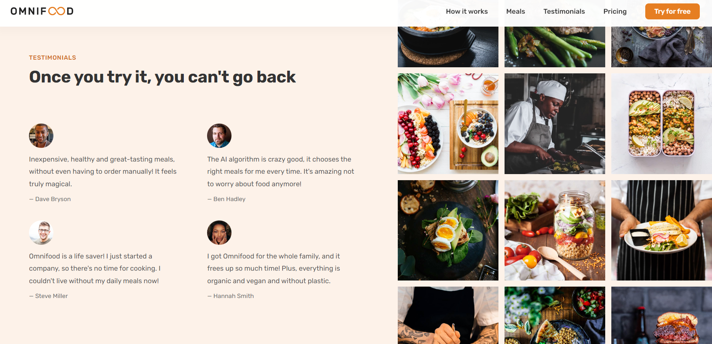

# Omnifood

Omnifood was developed as the final project of **Jonas Schmedtman's** course "The Complete JavaScript Course: From Zero to Expert". This project is a fully responsive restaurant website that demonstrates the comprehensive application of the concepts covered throughout the course.

## Main Feautures

- Flexbox: Utilized for creating flexible and responsive layout.

- Grid: Employed for a structured and adaptable grid system.

- Responsiveness: Achieved through media queries to ensure optimal display across various devices.

- Transform and Animations: Incorporated to enhance visual engagement and interactivity.

- Image Gallery: A dedicated section showcasing images in an organized gallery format.

- Testimonials: Section designed to display customer feedback and reviews.

- Sign-Up Form: Designed (static layout only) to facilitate user registration.

## Live Preview

[Omnifood](https://duckduckgo.com "The best search engine for privacy")

## Screenshot

